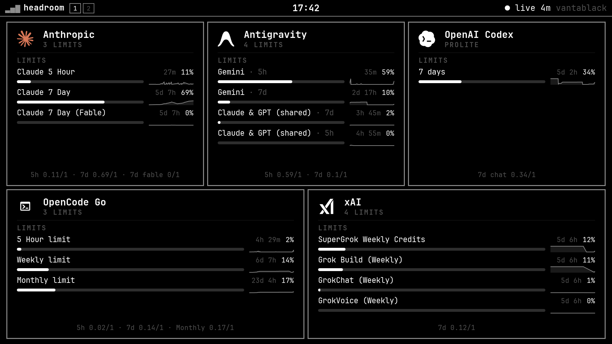
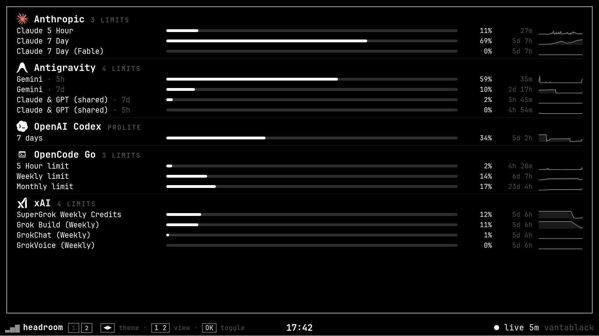
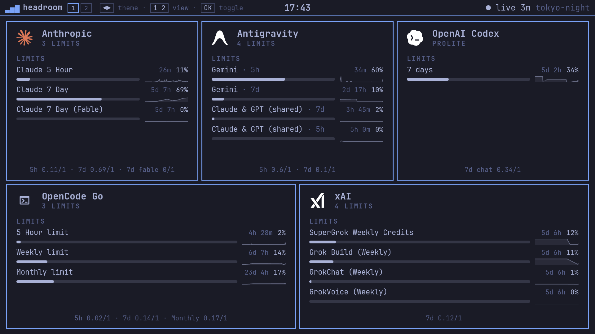

# headroom

A TV-friendly dashboard for an LG webOS TV. Today it shows AI provider rate
limits; tomorrow it wraps several dashboards, switched with CH+/CH−.



## What it does

- Collects `omp usage --json` (oh-my-pi coding agent) and shrinks it to a
  small JSON contract the TV can render.
- Pushes that JSON to the TV over ssh, where the webOS app re-reads it
  every 15 s.
- Renders tiles and list layouts with an Omarchy-styled design system and
  eight themes.
- Guards the OLED: the layout rotates every minute, and the app dims after
  30 min without a key press.




## Requirements

- An LG webOS TV in developer mode (or rooted) with ssh access.
- [mise](https://mise.jdx.dev) (installs Bun, Node, ares-cli, hk, Biome).
- `omp` on the pushing machine, for the usage dashboard.

## Setup

1. `mise trust && mise install && bun install`
2. `cp mise.local.toml.example mise.local.toml` and set `HEADROOM_TV` to the
   TV's ssh host (an alias in `~/.ssh/config`, or `user@host`):

   ```toml
   [env]
   HEADROOM_TV = "tv"
   ```

   `mise.local.toml` is git-ignored; the example is committed.
3. `mise build`
4. `mise deploy` — packages the IPK, installs it over ssh plus luna, launches
   it, then pushes data.

## Pushing data

`mise push` runs `omp usage --json` twice (current + 7-day history), reduces
it, and writes it atomically over ssh to the app's `data/usage.json`. Flags:
`--dry-run` (no push) and `--out <path>` (write the JSON locally).

A push timer example (systemd user unit, adjust paths to taste):

```ini
[Unit]
Description=Push usage data to the headroom TV dashboard

[Service]
Type=oneshot
WorkingDirectory=%h/code/headroom
ExecStart=%h/.local/bin/mise push

[Install]
WantedBy=default.target
```

```ini
[Timer]
OnBootSec=1min
OnUnitActiveSec=60s
```

A TV that is off (ssh exit 255) is skipped, not failed.

## Remote keys

| Key        | Action                                            |
| ---------- | ------------------------------------------------- |
| `1` / `2`  | Tiles / list (holds 10 min, then rotation resumes) |
| OK         | Toggle tiles / list                               |
| ◀ / ▶      | Previous / next theme                             |
| Colour     | Step theme                                        |
| CH+ / CH−  | Reserved for switching dashboards                 |
| Back       | Exit                                              |

Burn-in guards: the layout swaps tiles/list every minute (moving every lit
pixel), and the app dims to 45% after 30 min idle. Any key wakes it. The
screensaver is held off while the app runs.

## Project layout

- `src/app/` — the webOS app (TypeScript, bundled by esbuild to chrome79).
- `src/app/ui/` — the design system: small components returning HTML strings
  with `ui-` classes. All styling lives in `public/style.css` via tokens.
- `src/collector/` — the Bun collector: runs `omp usage`, reduces it, pushes
  over ssh.
- `src/shared/` — the `HeadroomData` JSON contract plus the app id constant.
- `scripts/tv.ts` — deploy / launch / screenshot / inspect over ssh.
- `scripts/sync-themes.ts` — regenerates `themes.generated.ts` from Omarchy.
- `docs/` — TV screenshots.

Type `mise` alone to see every task. Agents: read `AGENTS.md` first.

## Credits and license

MIT — see [LICENSE](LICENSE).

- Font: JetBrainsMono Nerd Font (`public/fonts/`), SIL Open Font License 1.1
  (`public/fonts/OFL.txt`).
- Provider marks: Anthropic and OpenAI marks via
  [Omarchy](https://omarchy.org) (MIT, © David Heinemeier Hansson); xAI and
  Google Antigravity marks via [Lobe Icons](https://lobehub.com/icons) (MIT,
  © 2023 LobeHub). All brand marks belong to their owners.
- Theme palettes (`src/app/themes.generated.ts`): generated from
  [Omarchy themes](https://github.com/basecamp/omarchy) (MIT), plus the
  built-in vantablack.
